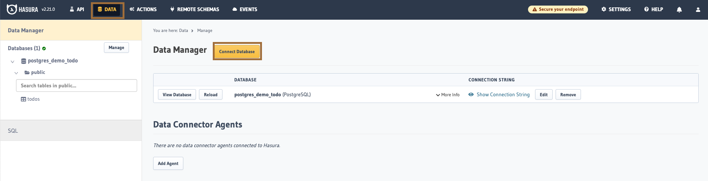
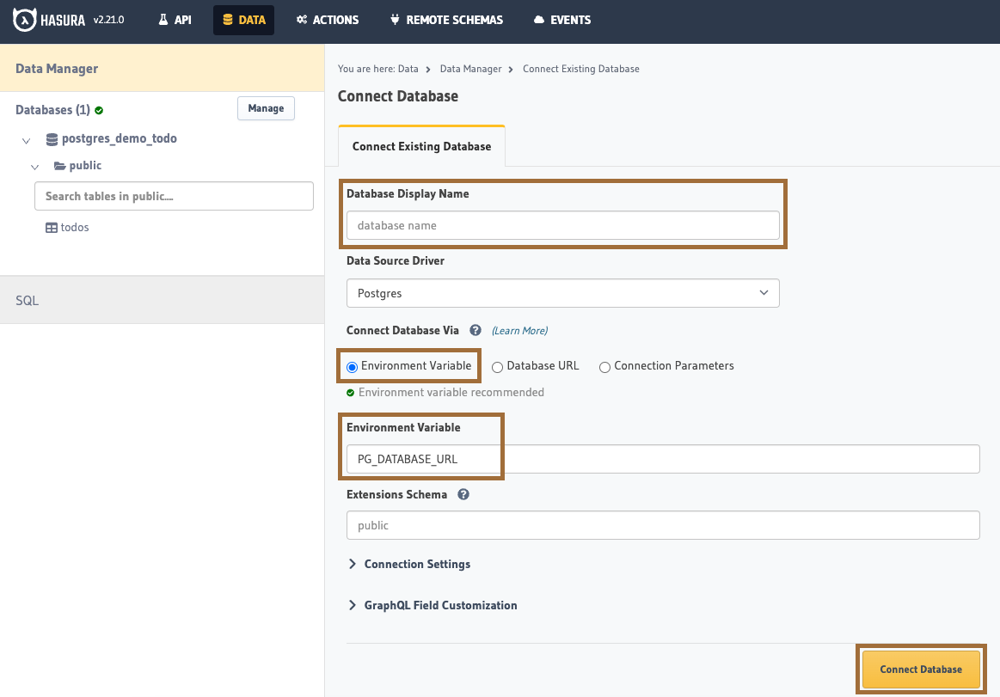
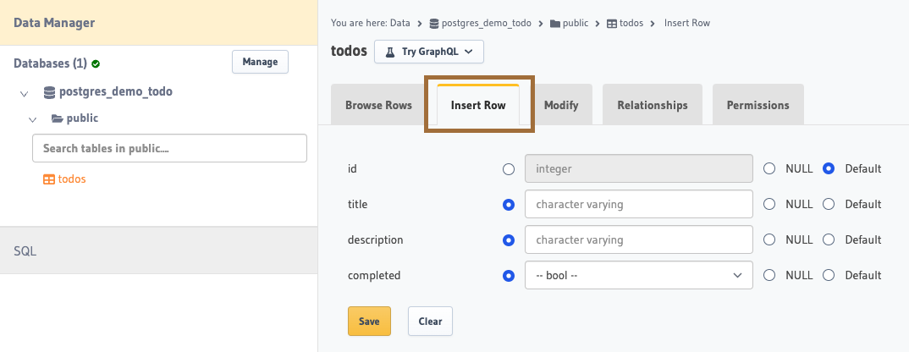
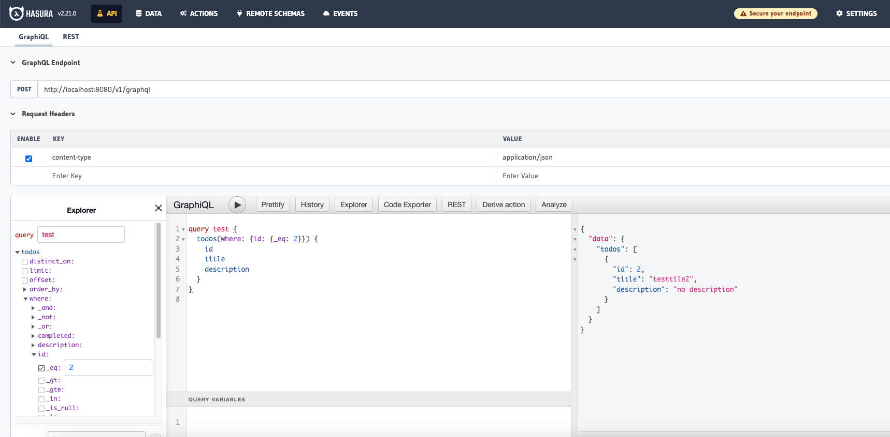

### Start up

```bash
$ docker-compose up -d
```

1. Open the Hasura Console by navigating to ``http://localhost:8080/console``, and connect to database (you need to create database first)

**enter name, choose Environment Variable, and enter PG_DATABASE_URL which is present in docker-compose's environment**


2. you can insert some row by raw sql or the console


3. Head to the API tab in the Console and try running the following query:
```
query test {
  todos(where: {id: {_eq: 2}}) {
    id
    title
    description
  }
}
```

